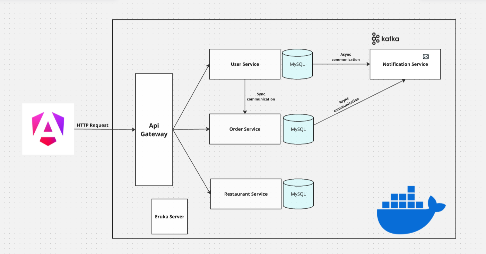
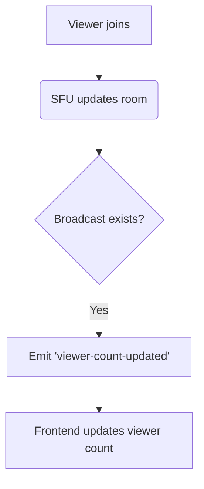

# StreamMyMeal Microservices Platform

A scalable, event-driven food delivery and live streaming platform built with **Java 17, Spring Boot microservices, PostgreSQL, Kafka, Docker, React, mediasoup, and WebSocket (socket.io & STOMP)**.

**Real-world use case:** StreamMyMeal helps restaurants build trust and transparency by broadcasting live cooking sessions from their kitchens. Customers watch chefs prepare food, see hygiene practices, and interact in real time addressing concerns about safety and authenticity. Users can discover, watch, and order food directly from live streams, with seamless order and payment management for an interactive, reassuring dining experience.

The system supports real-time broadcasts, live viewer stats, and robust order/payment management in a modern, cloud-ready architecture.

---

## 📚 Table of Contents
- [Architecture Overview](#architecture-overview)
- [Key Components](#key-components)
- [Technologies Used](#technologies-used)
- [Running the Project](#running-the-project)
- [WebRTC Live Streaming (SFU)](#webrtc-live-streaming-sfu)
- [Real-Time Features with WebSockets](#real-time-features-with-websockets)
- [Microservices Breakdown](#microservices-breakdown)
- [Code Structure](#code-structure)
- [Interview Highlights](#interview-highlights)

---

## 🏗️ Architecture Overview
This project adopts a **microservices-based architecture** for modularity, scalability, and fault isolation. It integrates both a dedicated **SFU (Selective Forwarding Unit) streaming server** (Node.js + mediasoup) for real-time live video, and a **Java Spring Boot live-streaming-service** for session management and business logic. All microservices use **PostgreSQL** for persistence.



---

## 🚀 Key Components
### Backend Services
- **API Gateway** (8080): Single entry point, routing, and load balancing.
- **Eureka Service Discovery** (8761): Service registration and discovery.
- **User Service** (8081): User authentication, profiles, JWT security.
- **Restaurant Service** (8082): Restaurant data, menus, image uploads.
- **Order Service** (8083): Order processing, status tracking.
- **Payment Service** (8084): Payment processing and integration.
- **Notification Service** (8085): Event-driven email notifications via Kafka.
- **Live Streaming Service** (8086): Java Spring Boot service for live session management, REST & WebSocket (STOMP) API, PostgreSQL.
- **Live Streaming SFU Server** (4000): Node.js + mediasoup for scalable, low-latency live video and real-time signaling (socket.io).

### Frontend
- Modern UI (React + TailwindCSS)
- JWT-based authentication
- Real-time live streaming and viewer stats

---

## 🛠️ Technologies Used
**Backend:**
- Java 17, Spring Boot 3.3.4, Spring Cloud 2023.0.3
- Spring Security (JWT), PostgreSQL, Kafka, OpenAPI (Swagger)
- Node.js, mediasoup, socket.io (for SFU server)

**Frontend:**
- React, TypeScript, TailwindCSS

**DevOps & Tools:**
- Docker, Maven, Git

---

## 🚦 Running the Project
### Prerequisites
- Java 17, Node.js 18+, PostgreSQL 16+, Kafka, Docker, Maven

### Run All Microservices at Once (Recommended)
Use the provided setup-local/docker-compose.yml for a full local environment:
```bash
cd setup-local
# This will start PostgreSQL, Kafka, Redis, and all microservices
docker-compose up -d
```

### Run Services Individually
Each service can also be run independently:
```bash
cd <service-name>
mvn clean install
java -jar target/*.jar
```

### Frontend
```bash
cd frontend-app
npm install
npm start
```

### Live Streaming SFU Server
```bash
cd live-sfu-server
npm install
node server.js
```

---

## 🎥 WebRTC Live Streaming (SFU)

### What is it?
A dedicated **SFU (Selective Forwarding Unit) server** using mediasoup enables scalable, low-latency live video streaming for restaurants and viewers.

### How it works
- **Broadcaster**: Restaurant owner starts a live stream via the Broadcaster page.
- **Viewer**: Users watch live streams in real time on the Viewer or LiveStreaming page.
- **SFU Server**: Handles all media routing, ensuring efficient, scalable delivery to many viewers.
- **Live Streaming Service (Java)**: Manages live session state, integrates with SFU, exposes REST and WebSocket APIs for session and viewer management.

### Key Features
- **One broadcaster per room**: Enforced at the SFU level.
- **Room lifecycle**: Rooms are created when a broadcast starts and deleted when the broadcaster leaves.
- **Viewer count**: Real-time, accurate, and event-driven.
- **Broadcast existence**: Instantly checked via WebSocket.
- **Session management**: Java backend tracks all live sessions, integrates with restaurant and order services.

---

## ⚡ Real-Time Features with WebSockets

- **Socket.io** is used for all real-time signaling between frontend and SFU server.
- **Spring WebSocket (STOMP)** is used in the Java live-streaming-service for REST and event-driven updates.
- **Event-driven updates**:
  - Viewer count is updated instantly for all clients when someone joins/leaves a stream.
  - Broadcast existence is checked in real time before showing a stream.
- **No polling required**: The backend emits events (`viewer-count-updated`) to all clients in a room, and the frontend updates the UI immediately.

**Example event flow:**


---

## 🧩 Microservices Breakdown
| Service                | Tech Stack                | Responsibilities                                 |
|------------------------|--------------------------|--------------------------------------------------|
| API Gateway            | Spring Cloud             | Routing, load balancing, JWT auth                |
| Eureka Discovery       | Spring Cloud             | Service registry/discovery                       |
| User Service           | Spring Boot, PostgreSQL  | User CRUD, JWT, profile mgmt                     |
| Restaurant Service     | Spring Boot, PostgreSQL  | Restaurant CRUD, menu, images                    |
| Order Service          | Spring Boot, PostgreSQL  | Order mgmt, status, integration                  |
| Payment Service        | Spring Boot, PostgreSQL  | Payment processing                               |
| Notification Service   | Spring Boot, Kafka       | Email notifications, event-driven                |
| Live Streaming Service | Spring Boot, PostgreSQL, WebSocket | Live session mgmt, REST & WebSocket API, SFU integration |
| Live SFU Server        | Node.js, mediasoup       | WebRTC signaling, live video, real-time updates  |

---

## 📂 Code Structure
```
StreamMyMeal-microservices/
├── api-gateway/
├── eureka-server/
├── user-service/
├── restaurant-service/
├── order-service/
├── payment-service/
├── notification-service/
├── live-streaming-service/   # Java Spring Boot live session mgmt
├── live-sfu-server/         # Node.js + mediasoup SFU
├── frontend-app/            # React frontend
├── setup-local/             # Docker Compose, config, init scripts
└── README.md
```

---

## 📞 Contact & Contribution
For questions, suggestions, or contributions, please open an issue or pull request.

---


